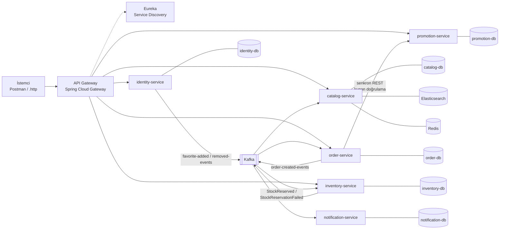
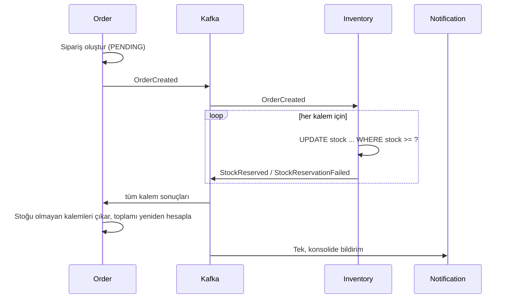

<div align="center">

# Shop Platform

**Mikroservis + event-driven Kafka mimarisiyle e-ticaret backend'i**

Kullanıcı, katalog, sipariş, stok, kupon ve bildirim süreçlerini her biri kendi veritabanına sahip
bağımsız servislere böler. Servisler Kafka event'leriyle haberleşir, sipariş–stok tutarlılığı
**choreography tabanlı Saga** ile sağlanır.


[Servisler](#-servisler) · [Mimari](#️-mimari) · [Tasarım Kararları](#-tasarım-kararları) ·
[Teknolojiler](#-teknolojiler) · [Hızlı Başlangıç](#-hızlı-başlangıç)

</div>

---

> 🚧 **Geliştirme devam ediyor.** Mimari tasarım ve altyapı tamamlandı. Şu an **identity-service** geliştiriliyor,
> diğer servisler sırayla eklenecek.

## 🧩 Servisler

| | Servis | Sorumluluk | Durum |
|---|---|---|---|
| 🔐 | **Identity** | Kayıt, giriş, JWT + refresh token, şifre değiştirme / sıfırlama, favoriler | 🟡 Geliştiriliyor |
| 📚 | **Catalog** | Ürün, hiyerarşik kategori, varyant (JSONB attribute), Elasticsearch ile arama | ⚪ Planlandı |
| 🛒 | **Order** | Sipariş oluşturma, mock ödeme, Saga ile kısmi sipariş kompanzasyonu | ⚪ Planlandı |
| 📦 | **Inventory** | Çoklu depo, atomik stok düşümü, stok hareket defteri (idempotent) | ⚪ Planlandı |
| 🏷️ | **Promotion** | Kupon / kampanya, checkout anında senkron doğrulama | ⚪ Planlandı |
| ✉️ | **Notification** | Sipariş ve şifre sıfırlama bildirimleri (Kafka tüketicisi) | ⚪ Planlandı |
| 🚪 | **API Gateway + Eureka** | Tek giriş noktası, service discovery | ⚪ Planlandı |

### identity-service — mevcut durum

| Endpoint | Açıklama |
|---|---|
| `POST /api/v1/auth/register` | Müşteri kaydı (rol her zaman `CUSTOMER`, BCrypt hash) |
| `POST /api/v1/auth/login` | Access token (15 dk) + refresh token döner |
| `POST /api/v1/auth/refresh` | Refresh token ile yeni access token |
| `POST /api/v1/auth/logout` | Refresh token'ı iptal eder |

## 🏗️ Mimari



- **Database-per-service:** Her servisin kendi PostgreSQL instance'ı var. Servisler arası FK yoktur, sadece ID referansı ve event kullanılır.
- **Asenkron önce:** Gecikmenin tolere edilebildiği her akış (stok, bildirim, favori sayacı) Kafka üzerinden gider.
- **Tek senkron bağımlılık:** Order → Promotion. Kupon geçerliliği sipariş oluşmadan önce bilinmelidir. Promotion yanıt vermezse sipariş kuponsuz oluşturulur (graceful degradation).

### Sipariş akışı (Saga — choreography)



### Depo yapısı

```
shop-platform/
├── docker-compose.yml        Postgres (servis başına), Redis, Kafka, Kafka UI, Elasticsearch
└── identity-service/         Spring Boot (Java 21)
    └── src/main/java/com/shopplatform/identity_service/
        ├── auth/             Register, login, refresh token, logout
        ├── user/             User entity, rol, repository, MapStruct mapper
        ├── favorite/         Favori kayıtları (composite key)
        ├── security/         Spring Security config, RS256 JWT servisi
        └── common/           Response zarfı, hata hiyerarşisi, global exception handler
```

## 🧠 Tasarım Kararları

| Konu | Karar | Gerekçe |
|---|---|---|
| **Stok tutarlılığı** | Eventual consistency + Saga (choreography) | Order, Inventory'nin ayakta olmasına bağımlı kalmasın. 2PC yüksek trafikte kilitlenir. |
| **Stok düşümü** | Tek atomik `UPDATE ... WHERE stock >= ?` | Kilit beklemeden doğru sonuç. İşlem commutative olduğu için event sırası önemsiz. |
| **Idempotency** | Stok hareketlerinde `UNIQUE` constraint | At-least-once teslimatta aynı event iki kez işlenmez. |
| **Kafka partition key** | `order-created-events` → `orderId` | `productId` kampanya dönemlerinde hotspot partition üretir. |
| **JWT imzası** | RS256 (anahtar çifti) | Private key sadece Identity'de. Diğer servisler public key ile doğrular, token üretemez. |
| **Oturum** | 15 dk access token + DB'de refresh token | Kısa ömürlü token + iptal edilebilir oturum (logout, şifre değişikliği). |
| **Şifre** | BCrypt, üst sınır **72 UTF-8 byte** | BCrypt ilk 72 byte'ı kullanır. Karakter limiti çok-byte'lı karakterlerde açık bırakır. |
| **Arama** | Catalog içinde Postgres + Elasticsearch dual-write | Servis sınırı geçilmediği için event gereksiz. |
| **API cevabı** | Standart response zarfı (`success`, `data`, `error`) | Başarılı ve hatalı tüm cevaplar tek formatta. |
| **i18n** | Mesaj anahtarları + `messages_{tr,en}.properties` | Varsayılan İngilizce, `Accept-Language: tr` ile Türkçe. |

## 🧰 Teknolojiler

**Backend:** Java 21 · Spring Boot 4.1 (Web MVC, Data JPA, Security, Validation) · Spring Cloud Gateway · Eureka
· Spring Kafka · Flyway · PostgreSQL 16 · Redis · Elasticsearch · JJWT · MapStruct · Lombok · springdoc-openapi (Swagger)

**Altyapı:** Docker Compose · Kafka (KRaft, Zookeeper'sız) · Kafka UI · GitHub Actions

## 🚀 Hızlı Başlangıç

**Gereksinimler:** JDK 21 · Docker + Docker Compose · OpenSSL

```bash
git clone https://github.com/eceugru/Shop-platform.git
cd Shop-platform
```

**1. Altyapı**

Kök dizinde bir `.env` dosyası oluşturun ve her servis için `POSTGRES_<SERVİS>_DB`, `POSTGRES_<SERVİS>_USER`,
`POSTGRES_<SERVİS>_PASSWORD` değerlerini tanımlayın (ör. `POSTGRES_IDENTITY_DB`). Sonra:

```bash
docker compose up -d
```

**2. identity-service**

JWT için RSA anahtar çifti üretin (`*.pem` dosyaları git'e girmez):

```bash
cd identity-service
mkdir keys
openssl genpkey -algorithm RSA -out keys/private.pem -pkeyopt rsa_keygen_bits:2048
openssl rsa -pubout -in keys/private.pem -out keys/public.pem
```

`identity-service/.env` dosyasına `DB_HOST`, `DB_PORT` (5433), `DB_NAME`, `DB_USERNAME`, `DB_PASSWORD` değerlerini yazın.
`JWT_*` değişkenleri opsiyoneldir, varsayılanları `application.yaml`'dadır.

```bash
./mvnw spring-boot:run        # Windows: mvnw.cmd spring-boot:run
```

Veritabanı şeması açılışta Flyway migration'larıyla otomatik oluşturulur.

| Servis | Adres |
|---|---|
| identity-service API | http://localhost:8280/api/v1 |
| Swagger UI | http://localhost:8280/swagger-ui.html |
| Kafka UI | http://localhost:8181 |
| Elasticsearch | http://localhost:9200 |
| identity-db | localhost:5433 |
| Redis | localhost:6379 |
| Kafka (host) | localhost:9094 |

## 🗺️ Yol Haritası

- [x] Domain analizi ve bounded context haritası
- [x] Sistem mimarisi: senkron/asenkron akışlar, Kafka topic tasarımı, darboğaz analizi
- [x] Database-per-service şema tasarımı
- [x] Docker Compose altyapısı
- [ ] identity-service: register, login, refresh, logout ✅ · şifre değiştirme / sıfırlama · favoriler
- [ ] Catalog, Inventory, Order, Promotion, Notification servisleri
- [ ] Kafka event akışları, Saga, dead-letter topic
- [ ] API Gateway + Eureka
- [ ] Redis cache (ürün listesi / kategori)
- [ ] GitHub Actions CI (build)

---

<div align="center">
<sub>Ödeme akışı simülasyondur, gerçek bir ödeme sağlayıcısına bağlı değildir. Lisans: Apache 2.0</sub>
</div>
